# Mermaid 다이어그램 스킬

> Mermaid 문법을 사용하여 다이어그램을 생성합니다.
> 포트폴리오의 **프로세스 흐름, 시퀀스 다이어그램** 작성에 적합합니다.

---

## 언제 이 방식을 사용하는가?

| 상황 | Mermaid 적합 |
|------|-------------|
| **플로우차트** | 비즈니스 로직, 의사결정 트리, 프로세스 흐름 |
| **시퀀스 다이어그램** | API 호출 흐름, 시스템 간 통신 (포트폴리오 핵심) |
| **ER 다이어그램** | 데이터베이스 스키마, 엔티티 관계 |
| **상태 다이어그램** | 상태 머신, 주문 라이프사이클 |
| **Git 그래프** | 브랜치 전략, 머지 플로우 |
| **간트 차트** | 프로젝트 타임라인 |
| **마인드맵** | 기술 스택 정리, 아키텍처 개요 |
| **C4 다이어그램** | 시스템 컨텍스트, 컨테이너 구조 |
| **복잡한 논리 흐름** | 조건 분기가 많은 경우 |

## 장점

- 텍스트 기반 문법으로 빠른 작성
- 자동 레이아웃 (노드 배치 자동화)
- 복잡한 분기/조건 표현 용이
- 시퀀스 다이어그램 특화
- Git 버전 관리 용이
- 20개 이상의 다이어그램 유형 지원

## 단점

- 세밀한 레이아웃 조정 어려움 → `/svg-diagram` 사용
- 커스텀 스타일 제한적
- Mermaid CLI 설치 필요 (SVG 파일 생성 시)
- 한글 폰트 렌더링 이슈 가능

## 사전 요구사항

```bash
# Mermaid CLI 설치 (SVG 파일 생성 시 필요)
npm install -g @mermaid-js/mermaid-cli

# 확인
mmdc --version
```

> **참고**: 마크다운 내 코드 블록으로 직접 사용 시 CLI 불필요

## 파일 구조

```
docs/career/portfolio/
├── portfolio.md                     # 포트폴리오 문서
└── images/
    ├── api-sequence.mmd             # Mermaid 소스 (선택)
    ├── api-sequence.svg             # 생성된 SVG
    └── order-flow.svg               # 주문 프로세스 다이어그램
```

### 파일명 규칙

| 유형 | 파일명 예시 |
|------|------------|
| 시퀀스 다이어그램 | `{feature}-sequence.svg` |
| 플로우차트 | `{process}-flow.svg` |
| ER 다이어그램 | `{domain}-er.svg` |
| 상태 다이어그램 | `{entity}-state.svg` |

---

## 지원 다이어그램 전체 목록

### 기본 다이어그램

| 유형 | 키워드 | 용도 |
|------|--------|------|
| **Flowchart** | `flowchart` / `graph` | 흐름도, 프로세스, 의사결정 |
| **Sequence Diagram** | `sequenceDiagram` | API 흐름, 시스템 간 통신 |
| **Class Diagram** | `classDiagram` | 클래스 관계, UML |
| **State Diagram** | `stateDiagram-v2` | 상태 머신, 라이프사이클 |
| **ER Diagram** | `erDiagram` | 데이터베이스 스키마, 테이블 관계 |
| **Gantt Chart** | `gantt` | 프로젝트 일정, 타임라인 |
| **Pie Chart** | `pie` | 데이터 비율, 분포 |
| **Mindmap** | `mindmap` | 개념 정리, 브레인스토밍 |

### 고급 다이어그램

| 유형 | 키워드 | 용도 |
|------|--------|------|
| **User Journey** | `journey` | 사용자 경험 흐름 |
| **GitGraph** | `gitGraph` | Git 커밋, 브랜치 시각화 |
| **C4 Diagram** | `C4Context` / `C4Container` | 시스템 아키텍처 (C4 모델) |
| **Quadrant Chart** | `quadrantChart` | 사분면 분석, 매트릭스 |
| **Timeline** | `timeline` | 연대표, 이벤트 순서 |
| **Requirement Diagram** | `requirementDiagram` | 요구사항 추적 |
| **Sankey Diagram** | `sankey-beta` | 흐름/에너지 분석 |
| **XY Chart** | `xychart-beta` | 좌표 기반 차트, 라인/바 |
| **Block Diagram** | `block-beta` | 시스템 구성 요소 |
| **Packet Diagram** | `packet-beta` | 네트워크 패킷 구조 |
| **Kanban** | `kanban` | 작업 상태 관리 |
| **Architecture** | `architecture-beta` | 클라우드/시스템 아키텍처 |

---

## Diagram Syntax 레퍼런스

### 1. Flowchart (플로우차트)

가장 많이 사용되는 다이어그램. 프로세스 흐름, 의사결정, 시스템 구조 표현.

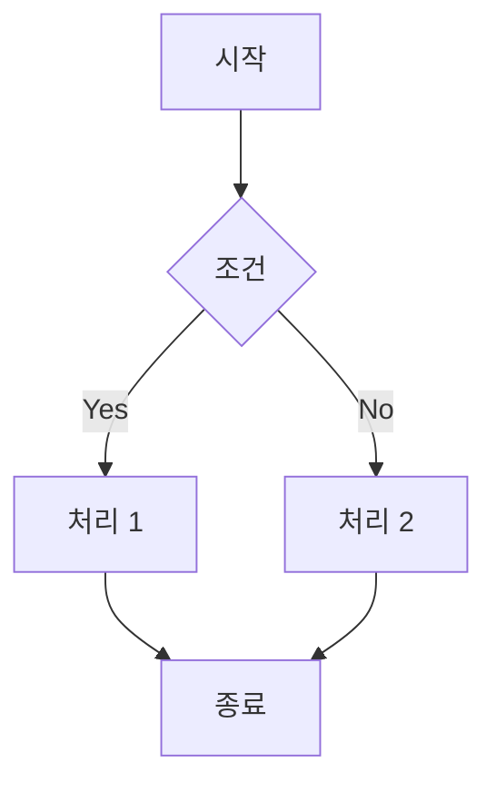
```mermaid
flowchart TD
    A[시작] --> B{조건}
    B -->|Yes| C[처리 1]
    B -->|No| D[처리 2]
    C --> E[종료]
    D --> E
```

**방향 옵션:**

| 방향 | 설명 | 예시 |
|------|------|------|
| `TB` / `TD` | Top to Bottom (위→아래) | 일반적인 플로우차트 |
| `BT` | Bottom to Top (아래→위) | 역방향 흐름 |
| `LR` | Left to Right (왼쪽→오른쪽) | 아키텍처 다이어그램 |
| `RL` | Right to Left (오른쪽→왼쪽) | RTL 언어 문서 |

**노드 형태:**

| 문법 | 모양 | 용도 |
|------|------|------|
| `A[텍스트]` | 사각형 | 프로세스, 작업 |
| `A(텍스트)` | 둥근 사각형 | 시작/종료 |
| `A([텍스트])` | 스타디움 | 터미널 |
| `A[[텍스트]]` | 서브루틴 | 서브프로세스 |
| `A[(텍스트)]` | 원통 | 데이터베이스 |
| `A((텍스트))` | 원 | 연결점 |
| `A{텍스트}` | 마름모 | 조건/분기 |
| `A{{텍스트}}` | 육각형 | 준비 단계 |
| `A[/텍스트/]` | 평행사변형 | 입력 |
| `A[\텍스트\]` | 역평행사변형 | 출력 |

**연결선:**

| 문법 | 설명 |
|------|------|
| `A --> B` | 화살표 |
| `A --- B` | 선 (화살표 없음) |
| `A -.-> B` | 점선 화살표 |
| `A ==> B` | 굵은 화살표 |
| `A --텍스트--> B` | 라벨이 있는 화살표 |
| `A <--> B` | 양방향 화살표 |

**Subgraph (그룹핑):**

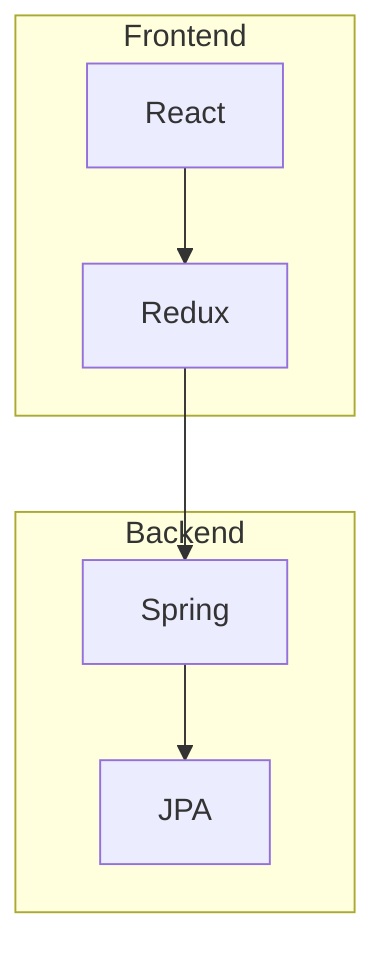
```mermaid
graph TB
    subgraph Frontend
        A[React] --> B[Redux]
    end
    subgraph Backend
        C[Spring] --> D[JPA]
    end
    B --> C
```

---

### 2. Sequence Diagram (시퀀스 다이어그램)

API 호출, 시스템 간 통신 흐름 표현에 적합.

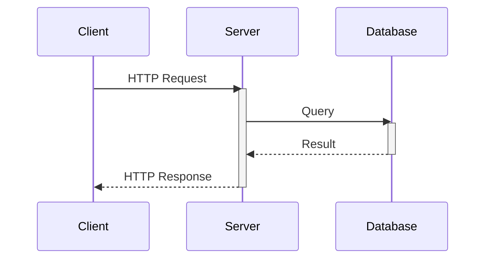
```mermaid
sequenceDiagram
    participant C as Client
    participant S as Server
    participant D as Database

    C->>S: HTTP Request
    activate S
    S->>D: Query
    activate D
    D-->>S: Result
    deactivate D
    S-->>C: HTTP Response
    deactivate S
```

**화살표 유형:**

| 문법 | 설명 |
|------|------|
| `->` | 실선 (동기) |
| `-->` | 점선 (응답) |
| `->>` | 실선 + 화살표 |
| `-->>` | 점선 + 화살표 |
| `-x` | 실선 + X (실패) |
| `-)` | 실선 + 열린 화살표 (비동기) |

**고급 기능:**

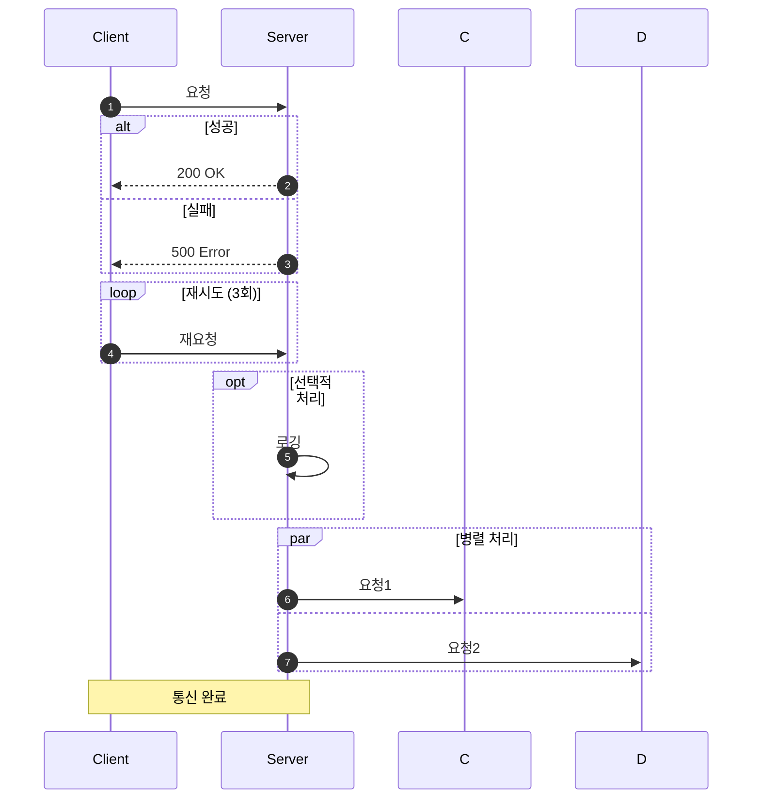
```mermaid
sequenceDiagram
    autonumber
    participant A as Client
    participant B as Server

    A->>B: 요청

    alt 성공
        B-->>A: 200 OK
    else 실패
        B-->>A: 500 Error
    end

    loop 재시도 (3회)
        A->>B: 재요청
    end

    opt 선택적 처리
        B->>B: 로깅
    end

    par 병렬 처리
        B->>C: 요청1
    and
        B->>D: 요청2
    end

    Note over A,B: 통신 완료
```

---

### 3. Class Diagram (클래스 다이어그램)

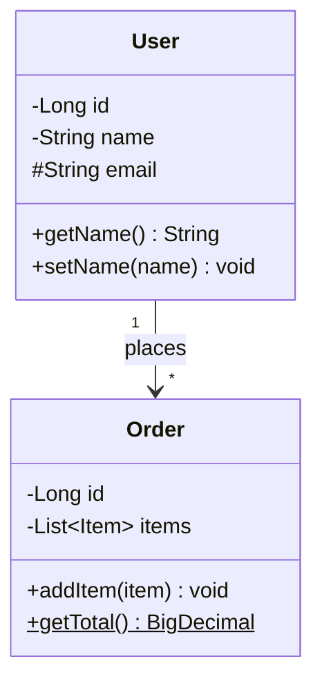
```mermaid
classDiagram
    class User {
        -Long id
        -String name
        #String email
        +getName() String
        +setName(name) void
    }

    class Order {
        -Long id
        -List~Item~ items
        +addItem(item) void
        +getTotal()$ BigDecimal
    }

    User "1" --> "*" Order : places
```

**접근 제어자:**

| 기호 | 접근 제어자 |
|------|------------|
| `+` | public |
| `-` | private |
| `#` | protected |
| `~` | package/internal |

**관계 표현:**

| 문법 | 관계 | 설명 |
|------|------|------|
| `<\|--` | 상속 (Inheritance) | 자식 클래스 |
| `*--` | 컴포지션 (Composition) | 강한 소유 |
| `o--` | 집합 (Aggregation) | 약한 소유 |
| `-->` | 연관 (Association) | 일반 관계 |
| `..>` | 의존 (Dependency) | 사용 관계 |
| `..\|>` | 구현 (Realization) | 인터페이스 구현 |

---

### 4. State Diagram (상태 다이어그램)

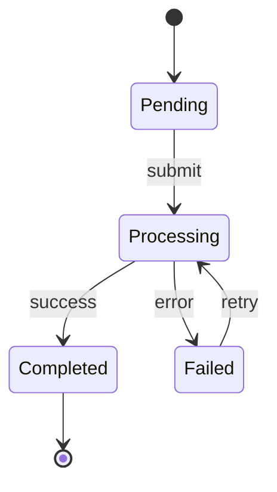
```mermaid
stateDiagram-v2
    [*] --> Pending
    Pending --> Processing : submit
    Processing --> Completed : success
    Processing --> Failed : error
    Failed --> Processing : retry
    Completed --> [*]
```

**복합 상태:**

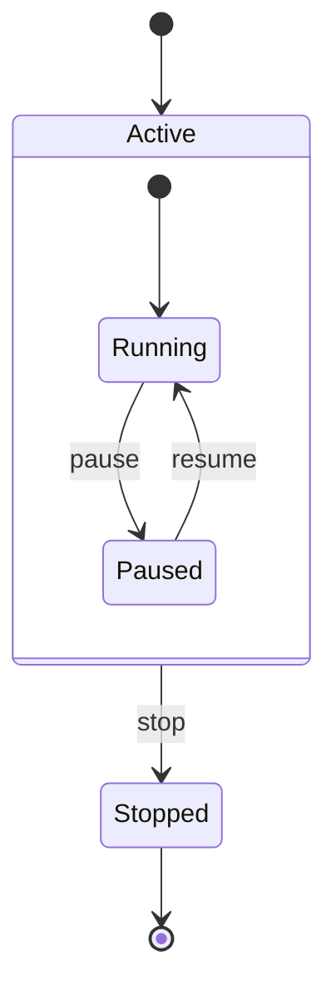
```mermaid
stateDiagram-v2
    [*] --> Active

    state Active {
        [*] --> Running
        Running --> Paused : pause
        Paused --> Running : resume
    }

    Active --> Stopped : stop
    Stopped --> [*]
```

---

### 5. ER Diagram (개체 관계 다이어그램)

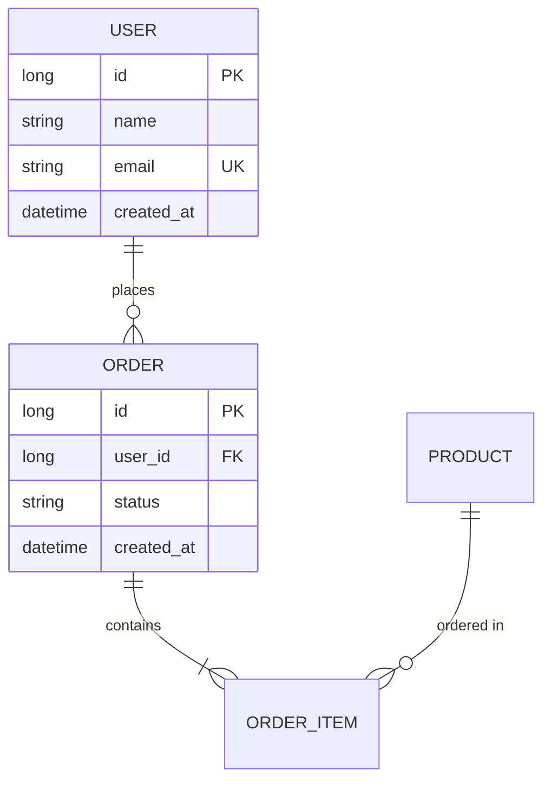
```mermaid
erDiagram
    USER ||--o{ ORDER : places
    ORDER ||--|{ ORDER_ITEM : contains
    PRODUCT ||--o{ ORDER_ITEM : "ordered in"

    USER {
        long id PK
        string name
        string email UK
        datetime created_at
    }

    ORDER {
        long id PK
        long user_id FK
        string status
        datetime created_at
    }
```

**관계 표기:**

| 왼쪽 | 오른쪽 | 의미 |
|------|--------|------|
| `\|\|` | `\|\|` | 정확히 1 대 1 |
| `\|\|` | `o{` | 1 대 0 이상 |
| `\|\|` | `\|{` | 1 대 1 이상 |
| `o\|` | `o{` | 0 또는 1 대 0 이상 |

**속성 키:**

| 키 | 의미 |
|----|------|
| `PK` | Primary Key |
| `FK` | Foreign Key |
| `UK` | Unique Key |

---

### 6. Gantt Chart (간트 차트)

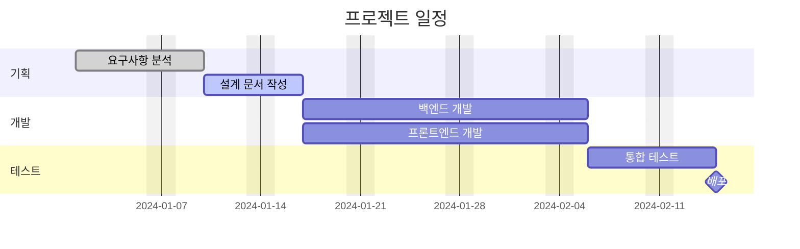
```mermaid
gantt
    title 프로젝트 일정
    dateFormat YYYY-MM-DD
    excludes weekends

    section 기획
    요구사항 분석    :done,    des1, 2024-01-01, 7d
    설계 문서 작성   :active,  des2, after des1, 5d

    section 개발
    백엔드 개발     :         dev1, after des2, 14d
    프론트엔드 개발  :         dev2, after des2, 14d

    section 테스트
    통합 테스트     :         test1, after dev1, 7d
    배포           :milestone, deploy, after test1, 0d
```

**태스크 상태:**

| 상태 | 설명 |
|------|------|
| `done` | 완료됨 |
| `active` | 진행 중 |
| `crit` | 크리티컬 패스 |
| `milestone` | 마일스톤 |

---

### 7. GitGraph (Git 그래프)

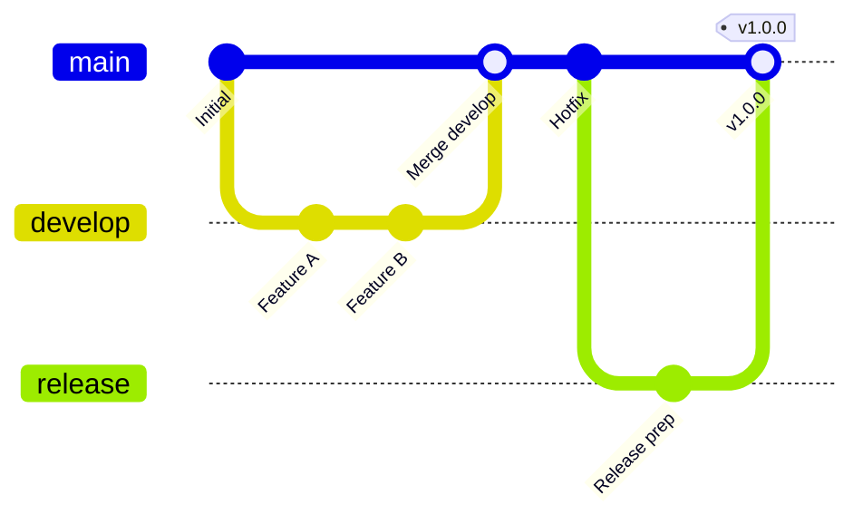
```mermaid
gitGraph
    commit id: "Initial"
    branch develop
    checkout develop
    commit id: "Feature A"
    commit id: "Feature B"
    checkout main
    merge develop id: "Merge develop"
    commit id: "Hotfix"
    branch release
    checkout release
    commit id: "Release prep"
    checkout main
    merge release id: "v1.0.0" tag: "v1.0.0"
```

---

### 8. Mindmap (마인드맵)

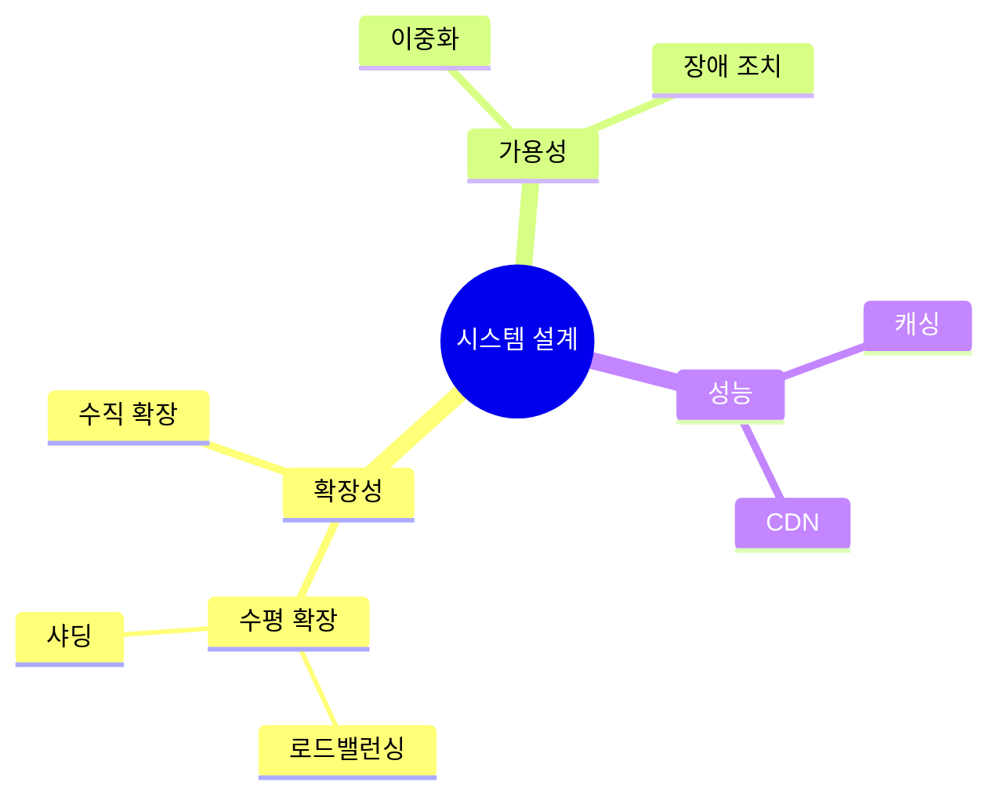
```mermaid
mindmap
  root((시스템 설계))
    확장성
      수평 확장
        로드밸런싱
        샤딩
      수직 확장
    가용성
      이중화
      장애 조치
    성능
      캐싱
      CDN
```

---

### 9. Timeline (타임라인)

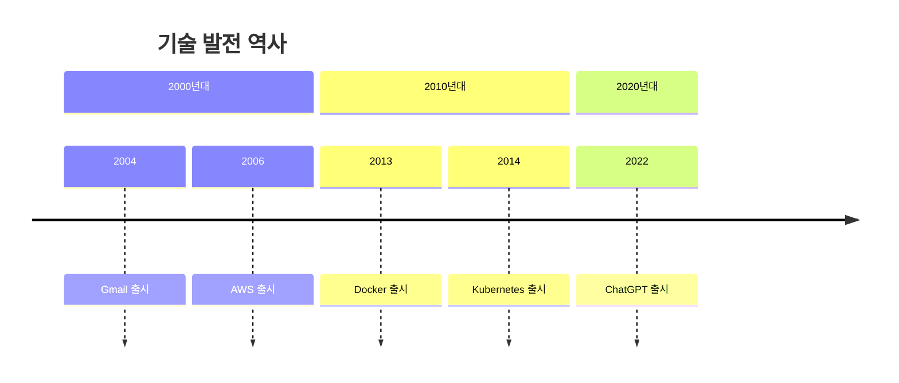
```mermaid
timeline
    title 기술 발전 역사
    section 2000년대
        2004 : Gmail 출시
        2006 : AWS 출시
    section 2010년대
        2013 : Docker 출시
        2014 : Kubernetes 출시
    section 2020년대
        2022 : ChatGPT 출시
```

---

### 10. Quadrant Chart (사분면 차트)

기술 평가, 우선순위 매트릭스, 의사결정에 활용.

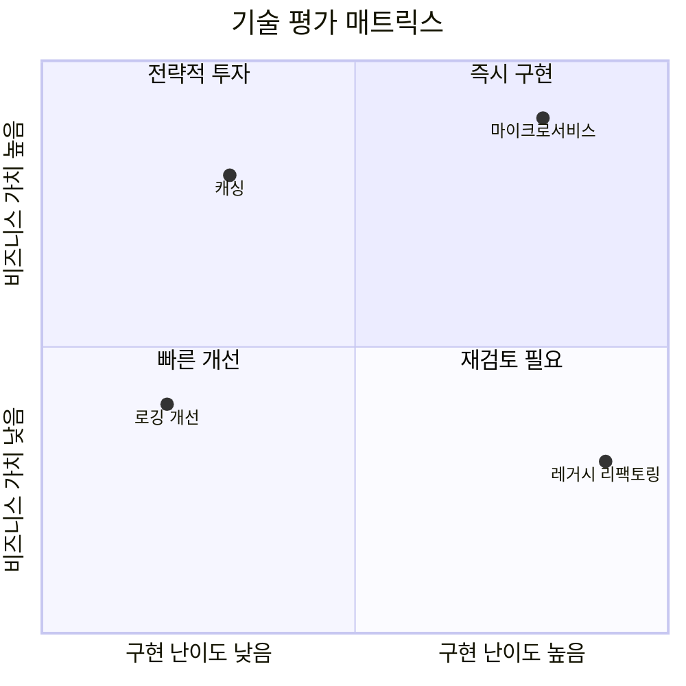
```mermaid
quadrantChart
    title 기술 평가 매트릭스
    x-axis 구현 난이도 낮음 --> 구현 난이도 높음
    y-axis 비즈니스 가치 낮음 --> 비즈니스 가치 높음
    quadrant-1 즉시 구현
    quadrant-2 전략적 투자
    quadrant-3 빠른 개선
    quadrant-4 재검토 필요
    캐싱: [0.3, 0.8]
    마이크로서비스: [0.8, 0.9]
    로깅 개선: [0.2, 0.4]
    레거시 리팩토링: [0.9, 0.3]
```

**사분면 위치:**
- `quadrant-1`: 우상단 (높은 가치, 높은 난이도)
- `quadrant-2`: 좌상단 (높은 가치, 낮은 난이도)
- `quadrant-3`: 좌하단 (낮은 가치, 낮은 난이도)
- `quadrant-4`: 우하단 (낮은 가치, 높은 난이도)

---

### 11. Pie Chart (파이 차트)

데이터 비율, 분포 시각화.

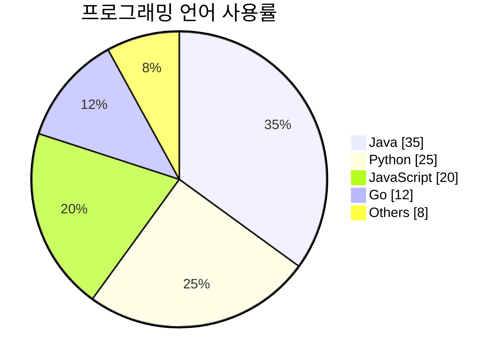
```mermaid
pie showData
    title 프로그래밍 언어 사용률
    "Java" : 35
    "Python" : 25
    "JavaScript" : 20
    "Go" : 12
    "Others" : 8
```

**옵션:**
- `showData`: 퍼센트 값 표시
- `title`: 차트 제목

---

### 12. User Journey (사용자 여정)

UX 흐름, 사용자 경험 만족도 시각화.

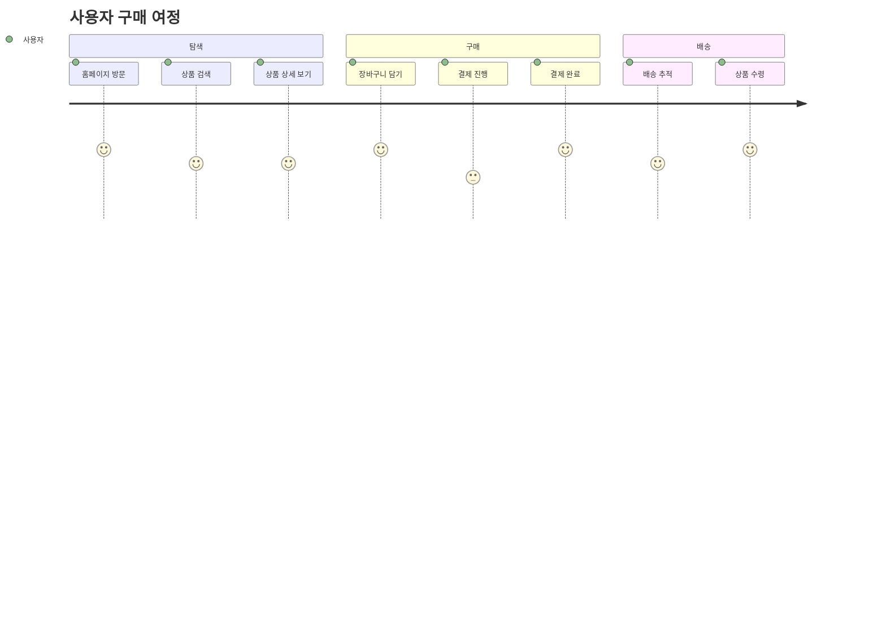
```mermaid
journey
    title 사용자 구매 여정
    section 탐색
      홈페이지 방문: 5: 사용자
      상품 검색: 4: 사용자
      상품 상세 보기: 4: 사용자
    section 구매
      장바구니 담기: 5: 사용자
      결제 진행: 3: 사용자
      결제 완료: 5: 사용자
    section 배송
      배송 추적: 4: 사용자
      상품 수령: 5: 사용자
```

**문법:**
- `section`: 단계 그룹
- `작업명: 만족도(1-5): 액터`

---

### 13. XY Chart (좌표 차트)

수치 데이터, 트래픽, 성능 지표 시각화.

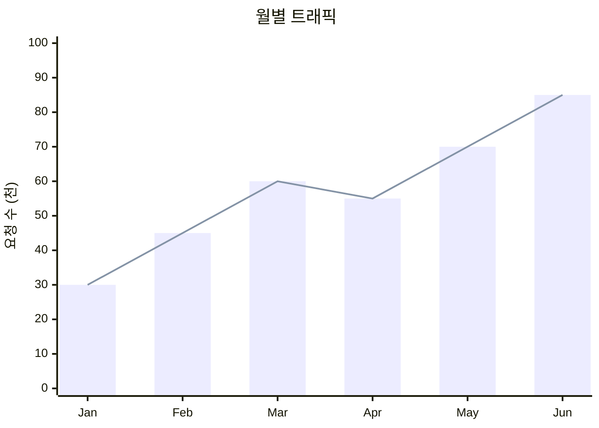
```mermaid
xychart-beta
    title "월별 트래픽"
    x-axis [Jan, Feb, Mar, Apr, May, Jun]
    y-axis "요청 수 (천)" 0 --> 100
    bar [30, 45, 60, 55, 70, 85]
    line [30, 45, 60, 55, 70, 85]
```

**차트 유형:**
- `bar`: 막대 그래프
- `line`: 선 그래프
- 둘 다 함께 사용 가능

---

### 14. Kanban (칸반 보드)

작업 상태 관리, 스프린트 보드.

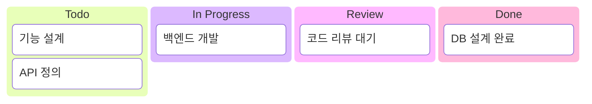
```mermaid
kanban
    Todo
        task1[기능 설계]
        task2[API 정의]
    In Progress
        task3[백엔드 개발]
    Review
        task4[코드 리뷰 대기]
    Done
        task5[DB 설계 완료]
```

**문법:**
- 열 이름을 먼저 작성
- 하위에 `taskId[작업명]` 형식으로 태스크 추가

---

### 15. Block Diagram (블록 다이어그램)

시스템 구성 요소, 아키텍처 블록 표현.

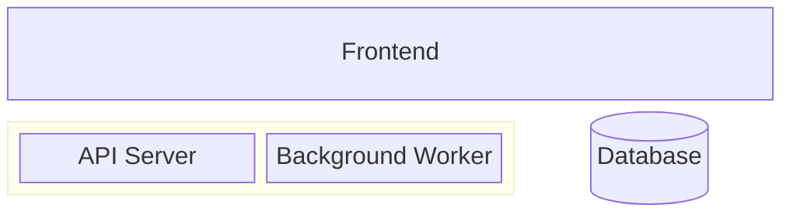
```mermaid
block-beta
    columns 3
    Frontend:3
    block:backend:2
        API["API Server"]
        Worker["Background Worker"]
    end
    DB[("Database")]:1
```

**문법:**
- `columns N`: 열 개수 지정
- `요소:N`: N칸 차지
- `block:id:N ... end`: 블록 그룹

---

### 16. Architecture Diagram (아키텍처 다이어그램)

클라우드/시스템 아키텍처, 인프라 구성.

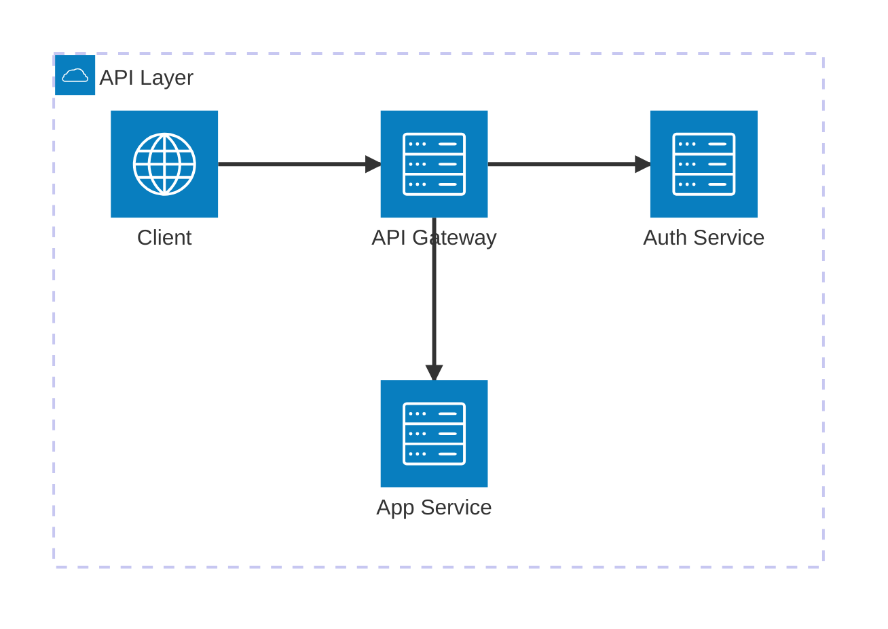
```mermaid
architecture-beta
    group api(cloud)[API Layer]

    service client(internet)[Client] in api
    service gateway(server)[API Gateway] in api
    service auth(server)[Auth Service] in api
    service app(server)[App Service] in api

    client:R --> L:gateway
    gateway:R --> L:auth
    gateway:B --> T:app
```

**아이콘 유형:**
- `cloud`, `server`, `database`, `disk`, `internet`

---

### 17. Sankey Diagram (생키 다이어그램)

흐름/에너지 분석, 데이터 흐름 시각화.

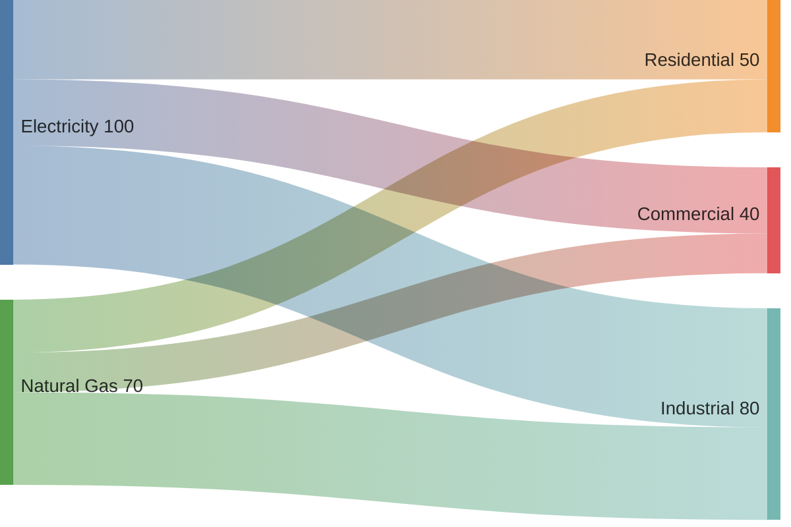
```mermaid
sankey-beta

%% source,target,value
Electricity,Residential,30
Electricity,Commercial,25
Electricity,Industrial,45
Natural Gas,Residential,20
Natural Gas,Commercial,15
Natural Gas,Industrial,35
```

**문법:**
- `source,target,value` 형식
- CSV 스타일로 흐름 정의

---

### 18. Requirement Diagram (요구사항 다이어그램)

요구사항 추적, 의존성 관리.

```mermaid
requirementDiagram
    requirement user_auth {
        id: REQ-001
        text: 사용자 인증 기능
        risk: high
        verifymethod: test
    }

    functionalRequirement login {
        id: REQ-001-1
        text: 로그인 기능 구현
        risk: medium
        verifymethod: test
    }

    element auth_module {
        type: module
        docRef: auth.md
    }

    user_auth - contains -> login
    auth_module - satisfies -> login
```

**관계:**
- `contains`: 포함
- `derives`: 파생
- `satisfies`: 충족
- `verifies`: 검증
- `refines`: 구체화
- `traces`: 추적

---

### 19. C4 Diagram (C4 아키텍처)

시스템 아키텍처를 4단계 레벨로 표현.

```mermaid
C4Context
    title System Context Diagram

    Person(user, "User", "시스템 사용자")
    System(system, "My System", "핵심 시스템")
    System_Ext(email, "Email System", "이메일 발송")

    Rel(user, system, "Uses")
    Rel(system, email, "Sends email")
```

**C4 레벨:**
- `C4Context`: 시스템 컨텍스트 (Level 1)
- `C4Container`: 컨테이너 (Level 2)
- `C4Component`: 컴포넌트 (Level 3)
- `C4Dynamic`: 동적 다이어그램

**요소:**
- `Person(id, label, description)`: 사용자
- `System(id, label, description)`: 내부 시스템
- `System_Ext(id, label, description)`: 외부 시스템
- `Container(id, label, tech, description)`: 컨테이너
- `Rel(from, to, label)`: 관계

---

### 20. Packet Diagram (패킷 다이어그램)

네트워크 패킷 구조 표현.

```mermaid
packet-beta
    0-15: "Source Port"
    16-31: "Destination Port"
    32-63: "Sequence Number"
    64-95: "Acknowledgment Number"
    96-99: "Data Offset"
    100-105: "Reserved"
    106-111: "Flags"
    112-127: "Window Size"
```

**문법:**
- `시작비트-끝비트: "필드명"`

---

## 용도별 다이어그램 선택 가이드

| 용도 | 추천 다이어그램 | 예시 |
|------|----------------|------|
| **로직/흐름 설명** | Flowchart | 알고리즘, 상태 전환, 의사결정 |
| **API/통신 흐름** | Sequence | 클라이언트-서버 요청, MSA 통신 |
| **시스템 구조** | Architecture / C4 / Block | MSA 구조, 인프라, 컴포넌트 |
| **개념 정리** | Mindmap | 학습 정리, 개념 분류 |
| **클래스 관계** | Class Diagram | OOP 설계, 디자인 패턴 |
| **상태 변화** | State Diagram | 상태 머신, 라이프사이클 |
| **DB 스키마** | ER Diagram | 테이블 관계, 데이터 모델 |
| **일정/타임라인** | Gantt / Timeline | 프로젝트 일정, 이벤트 순서 |
| **데이터 분포** | Pie Chart | 비율, 통계, 분포 |
| **Git 브랜치** | GitGraph | 브랜치 전략, 커밋 히스토리 |
| **사용자 경험** | User Journey | UX 흐름, 만족도 분석 |
| **기술 평가** | Quadrant Chart | 우선순위 매트릭스, 기술 선정 |
| **수치 데이터** | XY Chart | 트래픽, 성능 지표, 추이 |
| **작업 관리** | Kanban | 태스크 상태, 스프린트 보드 |
| **데이터 흐름** | Sankey | 에너지 흐름, 변환 분석 |
| **요구사항** | Requirement | 요구사항 추적, 의존성 |
| **패킷 구조** | Packet | 네트워크 프로토콜, 프레임 |

---

## CLI 사용법

### 기본 변환

```bash
# MMD 파일에서 SVG 생성
mmdc -i diagram.mmd -o diagram.svg

# PNG로 생성
mmdc -i diagram.mmd -o diagram.png

# 배경 투명
mmdc -i diagram.mmd -o diagram.svg -b transparent

# 테마 지정
mmdc -i diagram.mmd -o diagram.svg -t dark

# 크기 지정
mmdc -i diagram.mmd -o diagram.png -w 1920 -H 1080
```

### 설정 파일 사용

`mermaid-config.json`:
```json
{
  "theme": "base",
  "themeVariables": {
    "primaryColor": "#3498DB",
    "primaryTextColor": "#ffffff",
    "primaryBorderColor": "#2980B9",
    "lineColor": "#7F8C8D",
    "secondaryColor": "#2ECC71",
    "tertiaryColor": "#ECF0F1",
    "fontSize": "14px"
  }
}
```

```bash
mmdc -i diagram.mmd -o diagram.svg -c mermaid-config.json
```

### 테마 옵션

| 테마 | 설명 |
|------|------|
| `default` | 기본 테마 |
| `neutral` | 깔끔한 회색 기반 |
| `dark` | 다크 모드 |
| `forest` | 녹색 계열 |
| `base` | 커스터마이징 기본 |

---

## 스타일링

### 노드 스타일

```mermaid
graph LR
    A[기본] --> B[스타일 적용]

    style A fill:#fff,stroke:#333,stroke-width:2px
    style B fill:#ff6b6b,stroke:#c92a2a,stroke-width:2px,color:#fff
```

### 클래스 정의

```mermaid
graph LR
    A[Success]:::success --> B[Error]:::error

    classDef success fill:#c8e6c9,stroke:#2e7d32
    classDef error fill:#ffcdd2,stroke:#c62828
```

### 테마 초기화

```mermaid
%%{init: {'theme': 'base', 'themeVariables': { 'primaryColor': '#ff6b6b'}}}%%
graph LR
    A --> B
```

---

## 작성 절차

1. **Mermaid 코드 작성**: `.mmd` 파일 또는 마크다운 코드 블록
2. **SVG 변환**: `mmdc` 명령으로 변환 (또는 마크다운 내 직접 사용)
3. **파일 저장**: `docs/career/portfolio/images/{diagram-name}.svg`
4. **마크다운에서 참조**: ``
5. **git add 실행**

## 주의사항

1. **파일명**: kebab-case 사용 (예: `api-sequence.svg`)
2. **위치**: `docs/career/portfolio/images/` 폴더에 저장
3. **한글**: 일부 폰트에서 깨질 수 있음 - 테스트 필요
4. **복잡한 레이아웃**: 자동 배치가 마음에 안 들면 `/svg-diagram` 사용
5. **Mermaid CLI 미설치 시**: 마크다운 코드 블록 또는 SVG 직접 생성

## 참고 자료

- [Mermaid 공식 문서](https://mermaid.js.org/)
- [Mermaid Live Editor](https://mermaid.live/)

---

## 관련 스킬

- `/write-portfolio`: 포트폴리오 작성 (다이어그램 포함)
- `/svg-diagram`: SVG 직접 생성 (정교한 레이아웃)
- `/export`: PDF 내보내기
