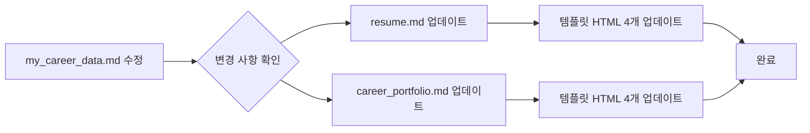

# 📁 Documentation Structure

본 디렉토리는 포트폴리오 웹사이트 관련 문서들을 체계적으로 관리하기 위한 공간입니다.

---

## 📂 디렉토리 구조

```
docs/
├── README.md                          # 이 파일 (문서 구조 안내)
├── career/                            # 경력 관련 문서
│   ├── my_career_data.md             # 경력 원본 데이터 (STAR 형식)
│   ├── resume.md                     # 간결한 이력서
│   └── career_portfolio.md           # 상세 경력기술서
├── references/                        # 참고 자료
│   ├── resume_writing_guide.md       # 이력서 작성 가이드
│   └── resume_examples.md            # 이력서 예시
└── analysis/                          # 분석 자료
    ├── tech_blog_analysis.md         # 기술 블로그 분석
    └── github_analysis.md            # GitHub 리포지토리 분석 (예정)
```

---

## 📄 문서 분류

### 1. 경력 문서 (`career/`)
포트폴리오의 핵심 콘텐츠인 경력 관련 문서를 관리합니다.

#### `my_career_data.md`
- **용도**: 경력 원본 데이터 저장소
- **형식**: STAR (Situation, Task, Action, Result)
- **역할**: 모든 이력서/경력기술서의 단일 진실 공급원(Single Source of Truth)
- **업데이트**: 이 파일을 수정하면 모든 템플릿이 자동으로 업데이트됨

#### `resume.md`
- **용도**: 간결한 1~2페이지 이력서
- **대상**: 채용 담당자, HR
- **내용**: 핵심 경력, 기술 스택, 주요 성과
- **생성**: `my_career_data.md` 기반 자동 생성

#### `career_portfolio.md`
- **용도**: 상세 경력기술서 (3~5페이지)
- **대상**: 기술 면접관, CTO
- **내용**: 프로젝트 상세 설명, 기술적 의사결정, 문제 해결 과정
- **생성**: `my_career_data.md` 기반 자동 생성

---

### 2. 참고 자료 (`references/`)
이력서 작성 및 개선을 위한 가이드와 예시 자료입니다.

#### `resume_writing_guide.md`
- **내용**: 경력직 백엔드 개발자 이력서 작성법
- **포함**:
  - STAR 기법 활용법
  - 정량적 성과 작성법
  - 기술 스택 분류 방법
  - 키워드 매칭 전략

#### `resume_examples.md`
- **내용**: 우수 이력서 예시 및 참고 사례
- **포함**:
  - Best Practice 예시
  - Before/After 비교
  - 프로젝트 기술 템플릿

---

### 3. 분석 자료 (`analysis/`)
포트폴리오 보강을 위한 외부 자료 분석 결과입니다.

#### `tech_blog_analysis.md`
- **대상**: [youn12.tistory.com](https://youn12.tistory.com/)
- **내용**:
  - 카테고리별 포스팅 현황 (80개)
  - 주요 기술 스택 및 프로젝트
  - 학습 패턴 및 인사이트
  - 블로그 한 줄 요약

#### `github_analysis.md` (예정)
- **대상**: [github.com/younwony](https://github.com/younwony)
- **내용**:
  - 공개 리포지토리 분석
  - 주요 사용 언어 및 프레임워크
  - 프로젝트 특징 및 기여도

---

## 🔄 문서 업데이트 워크플로우

### 이력서 업데이트 프로세스



### 업데이트 규칙
1. **단일 진실 공급원**: `my_career_data.md`만 직접 수정
2. **변경 범위 최소화**: 변경된 프로젝트/섹션만 업데이트
3. **일관성 유지**: 10개 파일 모두 동일한 내용으로 동기화
4. **검증**: 변경되지 않은 부분은 그대로 유지되었는지 확인

---

## 📝 파일 참조 관계

```
my_career_data.md (원본)
    ├── resume.md (간결)
    │   ├── templates/resume/default.html
    │   ├── templates/resume/corporate.html
    │   ├── templates/resume/minimal.html
    │   └── templates/resume/modern.html
    └── career_portfolio.md (상세)
        ├── templates/career/default.html
        ├── templates/career/corporate.html
        ├── templates/career/minimal.html
        └── templates/career/modern.html
```

---

## 🎯 사용 방법

### 경력 정보 추가/수정
```bash
1. docs/career/my_career_data.md 파일 편집
2. STAR 형식으로 새 프로젝트 추가 또는 기존 프로젝트 수정
3. Claude Code에 "이력서 업데이트 해줘" 요청
4. 10개 파일 자동 업데이트 확인
```

### 블로그/GitHub 분석 추가
```bash
1. docs/analysis/ 디렉토리에 분석 결과 저장
2. 필요시 index.html 카드 섹션에 반영
```

### 새로운 참고 자료 추가
```bash
1. docs/references/ 디렉토리에 문서 추가
2. README.md 업데이트하여 새 문서 설명 추가
```

---

## 📌 주의사항

### ❌ 하지 말아야 할 것
- `resume.md`, `career_portfolio.md`를 직접 수정 (자동 생성되므로)
- 템플릿 HTML 파일을 개별적으로 수정
- 변경되지 않은 프로젝트 섹션을 임의로 수정

### ✅ 해야 할 것
- 항상 `my_career_data.md`만 수정
- 변경 후 `git diff`로 변경 범위 확인
- 10개 파일 모두 일관되게 업데이트되었는지 검증
- STAR 형식 준수 (Situation, Task, Action, Result)

---

## 🔗 관련 파일

- **루트 README**: `../README.md` - 프로젝트 전체 설명
- **Claude 가이드**: `../CLAUDE.md` - AI 어시스턴트를 위한 작업 지침
- **템플릿 디렉토리**: `../templates/` - HTML 템플릿 파일들

---

## 📅 문서 이력

- **2025-11-30**: 문서 구조 재설계 및 `docs/` 디렉토리 생성
- **2025-11-30**: Tech Blog 분석 문서 추가
- **2025-11-29**: 경력 데이터 및 이력서 템플릿 업데이트

---

**문서 관리자**: Claude Code + 사용자
**최종 업데이트**: 2025-11-30
