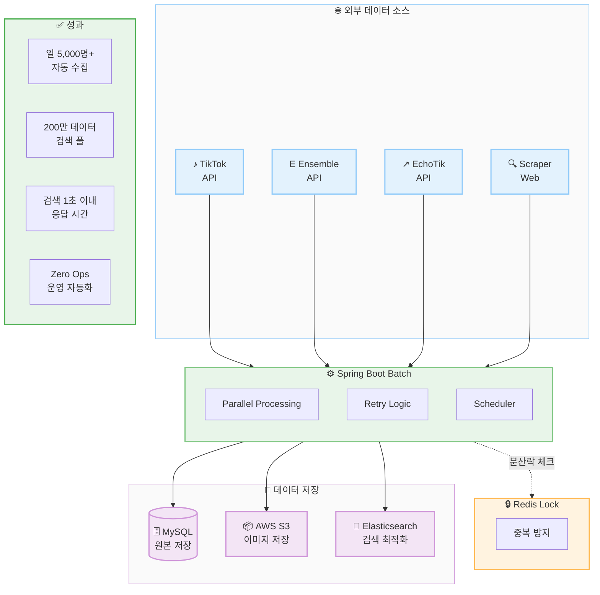

# After: 자동화된 데이터 파이프라인

## 아키텍처 구성요소

| 계층 | 컴포넌트 | 역할 |
|------|----------|------|
| Data Sources | TikTok, Ensemble, EchoTik API, Web Scraper | 외부 데이터 수집 |
| Processing | Spring Boot Batch | 병렬 처리 + 재시도 + 스케줄링 |
| Locking | Redis | 분산 환경 중복 방지 |
| Storage | MySQL, S3, Elasticsearch | 원본/이미지/검색 데이터 |

## 핵심 성과

| 지표 | Before | After | 개선율 |
|------|--------|-------|--------|
| 일일 수집량 | 수십 명 | 5,000명+ | 100x+ |
| 검색 응답 | 10초+ | 1초 이내 | 10x+ |
| 운영 개입 | 상시 | Zero Ops | 완전 자동화 |
| 데이터 풀 | 제한적 | 200만+ | 대규모 확장 |
