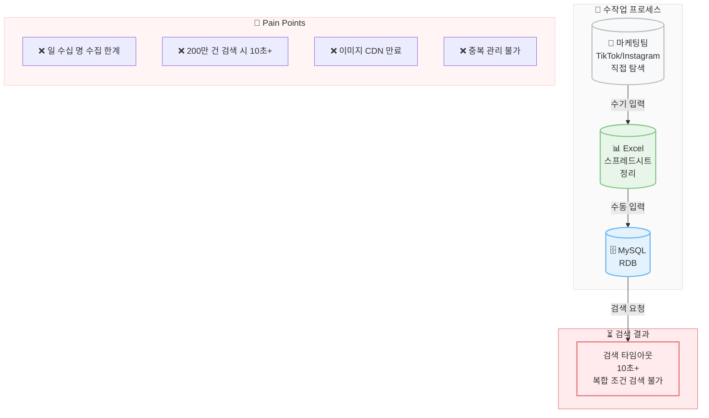

# Before: 수작업 데이터 수집 프로세스

## 주요 문제점

| 구분 | 문제 | 영향 |
|------|------|------|
| 수집 | 일 수십 명 한계 | 대형 캠페인 불가 |
| 검색 | 10초+ 타임아웃 | 복합 조건 검색 불가 |
| 이미지 | CDN 만료 | 프로필 유실 |
| 데이터 | 중복 관리 불가 | 데이터 품질 저하 |
